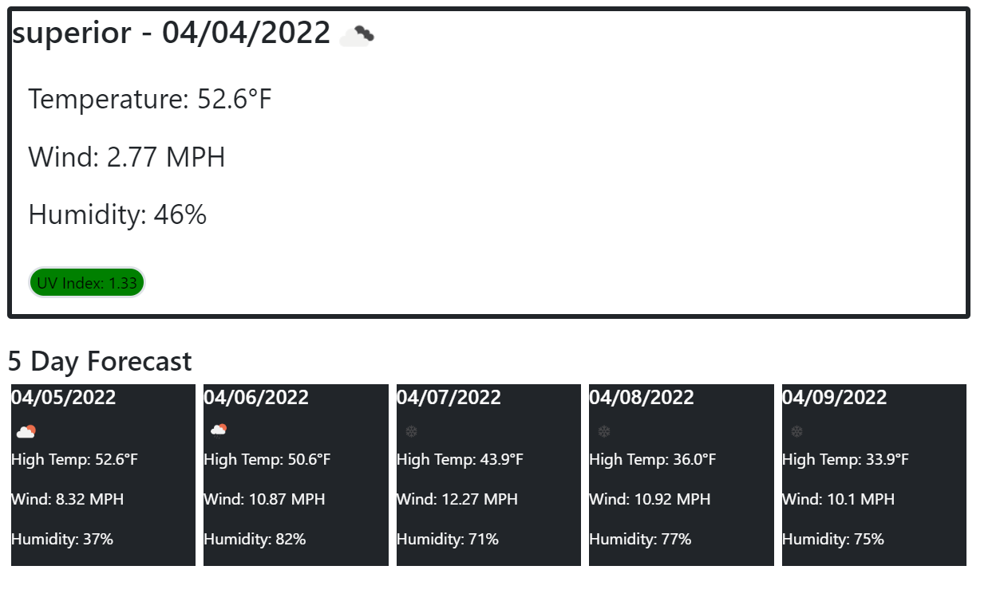

<!-- PROJECT LOGO -->
 

  

  <h3 align="center">Weather Checker Web App</h3>

  

    A quick, easy, way to check the weather in any city.
     
    <a href="https://github.com/powe0186/weatherChecker"><strong>Explore the docs »</strong></a>
     
     
    <a href="https://powe0186.github.io/weatherChecker/">View Demo</a>
    ·
    <a href="https://github.com/powe0186/weatherChecker/issues">Report Bug</a>
    ·
    <a href="https://github.com/powe0186/weatherChecker/issues">Request Feature</a>
  

<!-- TABLE OF CONTENTS -->

  
Table of Contents

  <ol>
    <li>
      <a href="#about-the-project">About The Project</a>
      <ul>
        <li><a href="#built-with">Built With</a></li>
      </ul>
    </li>
    <li>
      <a href="#getting-started">Getting Started</a>
      <ul>
        <li><a href="#prerequisites">Prerequisites</a></li>
        <li><a href="#installation">Installation</a></li>
      </ul>
    </li>
    <li><a href="#usage">Usage</a></li>
    <li><a href="#roadmap">Roadmap</a></li>
    <li><a href="#contributing">Contributing</a></li>
    <li><a href="#license">License</a></li>
    <li><a href="#contact">Contact</a></li>
    <li><a href="#acknowledgments">Acknowledgments</a></li>
  </ol>

<!-- ABOUT THE PROJECT -->
## About The Project

[![Weather Checker]

This web app allows you to input any city and instantly get back weather data. You can find temperature, wind speed, humidity,and UV index. 
It is also easy to search cities often. Buttons will be created keeping track of your last 5 city searches. Simply click and your search will run.

(<a href="#top">back to top</a>)

### Built With

* [Bootstrap](https://getbootstrap.com)
* [JQuery](https://jquery.com)

(<a href="#top">back to top</a>)

<!-- GETTING STARTED -->
## Getting Started

Open the web page. Type your desired city in the search box. For a more certain search, include the state. 

(<a href="#top">back to top</a>)

<!-- LICENSE -->
## License

Distributed under the MIT License. See `LICENSE.txt` for more information.

(<a href="#top">back to top</a>)

<!-- CONTACT -->
## Contact

Your Name - [@powe0186](https://twitter.com/powe0186) - powe0186@gmail.com

Project Link: [https://github.com/powe0186/weatherChecker](https://github.com/powe0186/weatherChecker)

(<a href="#top">back to top</a>)

